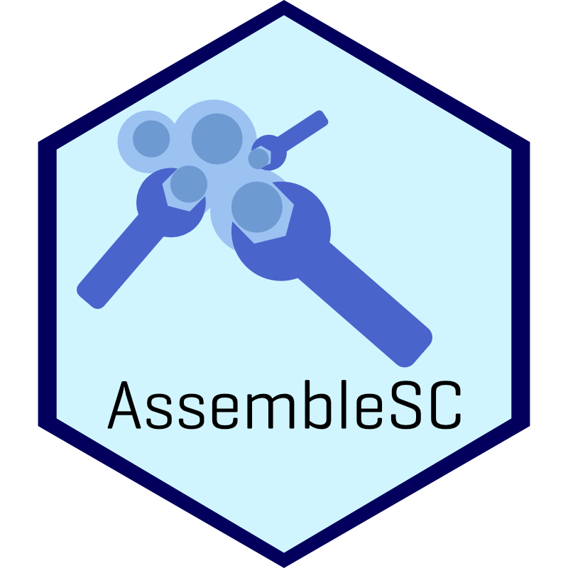

<!-- README.md is generated from README.Rmd. Please edit that file -->

```{r, include = FALSE}
knitr::opts_chunk$set(
  collapse = TRUE,
  comment = "#>",
  fig.path = "man/figures/README-",
  out.width = "100%"
)
```

# AssembleSC 

<!-- badges: start -->
<!-- badges: end -->

The goal of AssembleSC is to create a package that automates the assembly of single-cell RNA-seq data ingest, preprocessing, and some basic analyses/visualizations, primarily drawing from the Bioconductor universe of packages.

## Installation

<!-- You can install the released version of AssembleSC from [CRAN](https://CRAN.R-project.org) with: -->

<!-- ``` r -->
<!-- install.packages("AssembleSC") -->
<!-- ``` -->

You can install the development version of AssembleSC from github with:

```{r, eval=FALSE}
devtools::install_github('robertamezquita/AssembleSC')
```

## Workflow

### Ingest

`AssembleSC::ingest()` reads in results produced following alignment using one of the following supported aligners:

* STARsolo (modes: Gene, GeneFull)
* kb-python (a wrapper for kallisto|bustools)

Future versions will aim to support velocity results a la LaManno et al. (2019), as produced by STARsolo Velocyto or kb-python with the --lamanno flag enabled. Support for basic kallisto output that produces abundance.tsv files will also be supported in a future version.

The `AssembleSC::ingest()` function produces an annotated `SingleCellExperiment` object. 


